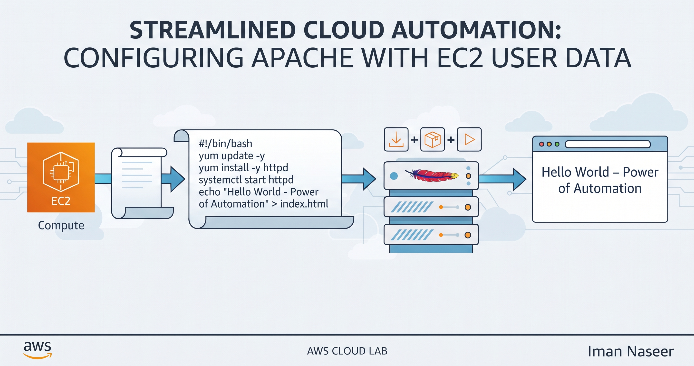

# AWS EC2 User Data & Apache Web Server Automation Lab

## Overview
This repository documents a hands-on cloud automation and server provisioning lab performed on **Amazon Web Services (AWS)**[cite: 1]. The objective of this project was to leverage **EC2 User Data** to automatically bootstrap an Apache web server, manage services on boot, and deploy custom web content without manual intervention[cite: 1].

---

## Lab Architecture & Workflow Banner


---

## Lab Documentation
- You can view and download the complete step-by-step lab report with screenshots here:  
  [Download Lab Report PDF](ApacheWithUserData.pdf)[cite: 1]

---

## Step-by-Step Methodology
1. **Instance Provisioning**: Launched an Amazon Linux instance (`ApacheWithUserData`) on EC2 using a `t3.micro` configuration[cite: 1].
2. **User Data Scripting**: Configured a bash script to execute on first boot to automate installation workflows[cite: 1].
3. **Package & Service Management**: Automatically updated system packages, installed Apache (`httpd`), and enabled `httpd.service` to start on boot[cite: 1].
4. **Web Content Deployment**: Echoed custom HTML output (`Hello World – Power of Automation`) directly into `/var/www/html/index.html`[cite: 1].
5. **Testing & Verification**: Accessed the instance's public IPv4 address in a web browser to verify successful rendering of the automated page[cite: 1].

---

## User Data Script (`user-data.sh`)
```bash
#!/bin/bash
yum update -y
yum install -y httpd.x86_64
systemctl start httpd.service
systemctl enable httpd.service
echo "<h1>Hello from $(hostname -f)</h1>" > /var/www/html/index.html
